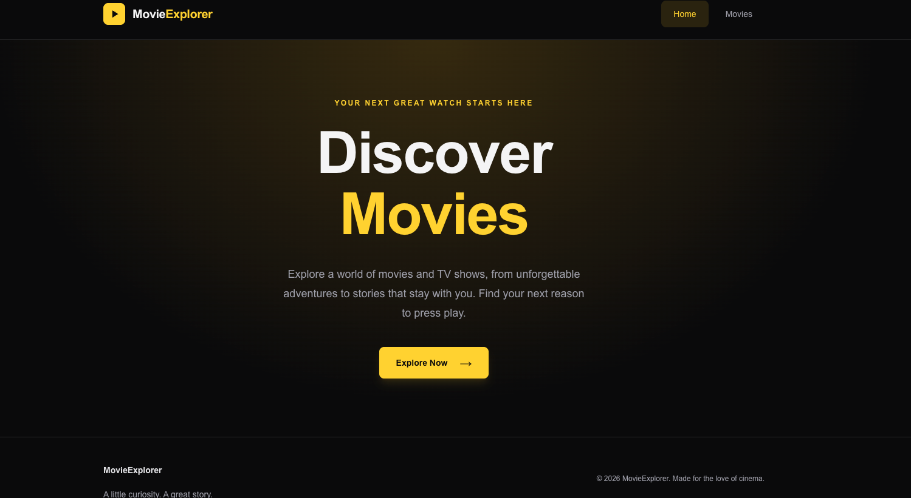
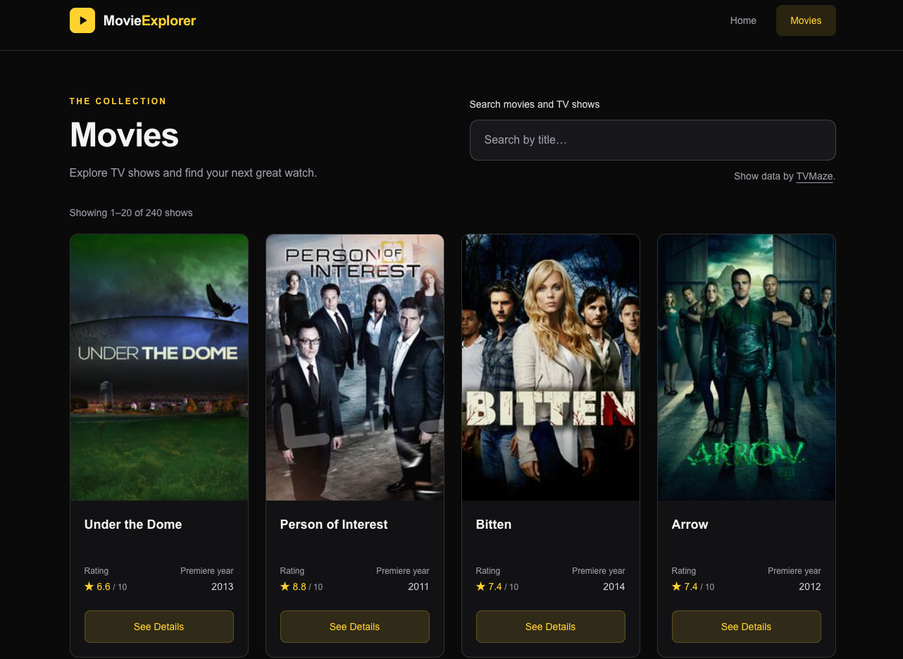

# 🎬 Movie Explorer

A modern and responsive **Movie Explorer** web application built with **React** and **Tailwind CSS**. The application allows users to browse TV shows, search for specific titles, and view detailed information through an interactive modal.

Movie data is fetched dynamically from the **TVMaze API**.

---

## 🌐 Live Demo

🔗 **Live Website:** (https://movie-explorer-silk-theta.vercel.app/)

🔗 **GitHub Repository:** (https://github.com/nurhossain-webd/Movie-Explorer.git)

---

## 📸 Screenshots

### 🏠 Home Page

The Home page provides a clean and modern introduction to Movie Explorer with a movie-themed hero section and direct navigation to the movie collection.



### 🎞️ Movies Page

The Movies page allows users to browse available shows, search by title, and open detailed information for individual movies or shows.



---

## ✨ Features

- 🎬 **Movie Browsing** – Browse a collection of shows dynamically loaded from the TVMaze API.
- 🔍 **Movie Search** – Search for movies and TV shows by title with dynamically updated results.
- 🖼️ **Reusable Movie Cards** – Each card displays the poster, title, rating, release information, and a details button.
- 📖 **Movie Details Modal** – View additional information such as summary, rating, release date, and genres without leaving the Movies page.
- ⚡ **Loading & Error States** – Provides feedback while movie data is loading and handles API errors gracefully.
- 🖼️ **Missing Data Handling** – Handles unavailable posters, ratings, dates, and other API data without breaking the interface.
- 📱 **Responsive Design** – Optimized for mobile, tablet, and desktop devices.
- 🎨 **Modern UI** – Dark cinema-inspired interface built with Tailwind CSS.
- 🧭 **Client-Side Navigation** – Smooth navigation between the Home and Movies pages using React Router.

---

## 🛠️ Technologies Used

| Technology       | Purpose                                             |
| ---------------- | --------------------------------------------------- |
| **React**        | Building the user interface and reusable components |
| **JavaScript**   | Application logic and functionality                 |
| **Vite**         | Development and build tooling                       |
| **Tailwind CSS** | Responsive styling and UI design                    |
| **React Router** | Client-side page navigation                         |
| **TVMaze API**   | Movie and TV show data                              |
| **Vercel**       | Application deployment                              |

---

## 🌐 API Integration

This project uses the free **TVMaze API** to retrieve movie and TV show information.

### Get All Shows

```http
GET https://api.tvmaze.com/shows
```
